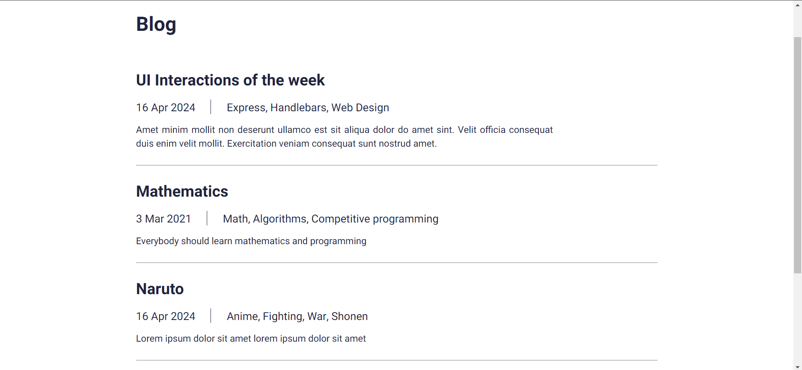

# BLOG app using JSON and MAMP server with only HTML, CSS & JS

> Install json-server: ```npm install -g json-server``` <br />
> Open admin.html and index.html with live server
> Run json-server: ```json-server --watch db.json```

## Admin Page


## Index Page


## Blog Page

