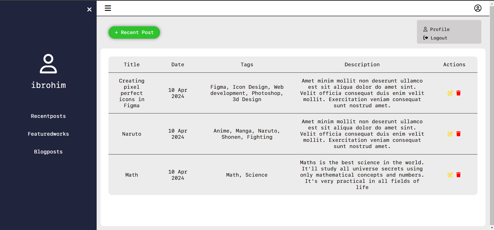
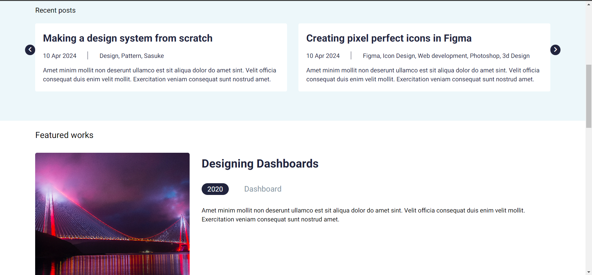

# BLOG app using JSON and MAMP server with only HTML, CSS & JS

> Install json-server: ```npm install -g json-server``` <br />
> Open admin.html and index.html with live server

## Admin Page


## Index Page

